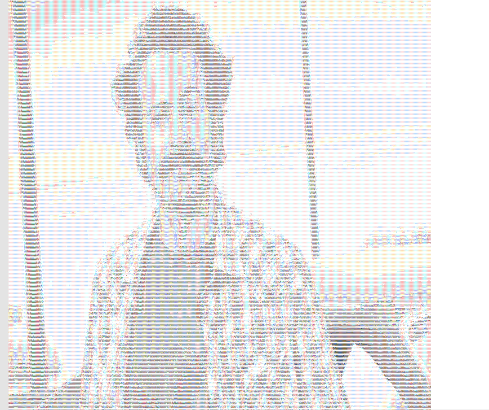

# ASCII Art

The idea of this project is to load images, translate them into ASCII ART images, optionally apply filters, and save them.

## How to create ASCII images

1. Build and run the scala src. (Hello, world should appear)
2. Type in image name, filters you want to apply and an output location as a single line in the terminal. (eg. --image "abcd.png" --table "default" --invert ----output-file "mytextabcd.txt" )
3. Find your ASCII image as the new txt file / in console.

Use <b>help</b> to get a list of all the possible filters. 

  
   

